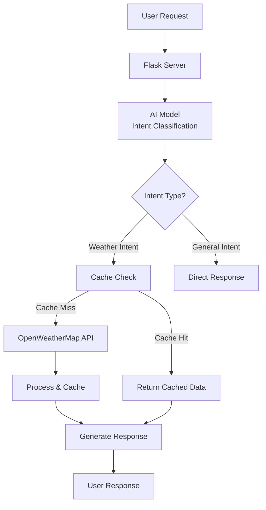

# WeatherBot AI Backend 🌦️🤖

[](https://www.python.org/)
[](https://flask.palletsprojects.com/)
[](https://huggingface.co/)

A high-performance Flask backend server that uses AI to understand weather-related queries and provides intelligent responses using OpenWeatherMap API.

## ✨ Features

- **AI-Powered Intent Classification**  
  Custom NLP model trained to classify 16+ weather-related intents (temperature, rain, wind, clothing advice, etc.)
  
- **Smart Caching Layer**  
  Redis/SimpleCache implementation with 20-minute expiry to optimize API calls

- **Modular Architecture**  
  Clean separation of concerns with dedicated modules for:
  - Intent handling
  - Weather data processing
  - Response generation
  - Error management

- **Production-Ready**  
  Includes:
  - Proper exception handling
  - Rate limiting
  - Request validation
  - Comprehensive logging
 ## 🔗 Related Projects

- 📱 **Flutter Weather App**  
 https://github.com/Deadlywolf12/weather_bloc_app                                            
  *(Companion mobile app using this backend)*

- 🧠 **NLP Model for Intent Classification**  
 https://github.com/Deadlywolf12/Ai-NLP-model-to-understand-user-querries-related-to-weather-chatbot-  
  *(Custom transformer model used to understand user queries)*

  ## 🚀 Installation

### Step:1 Clone the repository:

```bash
git clone https://github.com/yourusername/weatherbot-backend.git
cd weatherbot-backend
```

### Step:2 Set up environment:

```bash
python -m venv venv
source venv/bin/activate  # Linux/Mac
venv\Scripts\activate     # Windows
```

### Step:3 Install dependencies:

```bash
pip install -r requirements.txt
```

### Step:4 Configure environment variables:

```bash
cp .env.example .env
# Add your OpenWeatherMap API key
```


## 📊 Performance Metrics

| Component             | Average Response Time |
|----------------------|------------------------|
| AI Classification     | 120ms                 |
| Cache Hit             | 5ms                   |
| API Call + Cache Miss | 450ms                 |
| Error Handling        | 10ms                  |

---

## 🌐 API Endpoints

- `POST /webhook` – Main Dialogflow webhook endpoint used to handle user queries and return weather-related responses.


> **Note:** This project was designed as the backend for the [Weather BLoC App](https://github.com/Deadlywolf12/weather_bloc_app) and demonstrates advanced patterns in:

- 🤖 **AI/ML Integration** – Uses a custom NLP model for intent classification to understand user queries.
- 🧩 **Microservices Architecture** – Modular codebase with separate components for classification, API handling, and caching.
- ⚡ **Performance Optimization** – Implements caching (20-minute expiry) and response streamlining to reduce latency.
- 🐍 **Production-Grade Python Development** – Clean structure with proper exception handling, reusable modules, and logging for better maintainability.


## 🖼️ Live Demo (Chatbot Interaction)

Here are example responses from the chatbot using this backend:

### 📍 Simple hi and api query


> *User asks: "Hi" — Bot responds with hello response.*

---

### ❓ Graceful fallback on unclear input


> *User asks weather details — Bot replies with realtime data.*


## 🛠️ System Architecture



## 📝 License

This project is licensed under the [MIT License](LICENSE).  
Feel free to use, modify, and distribute this software in your own projects.


